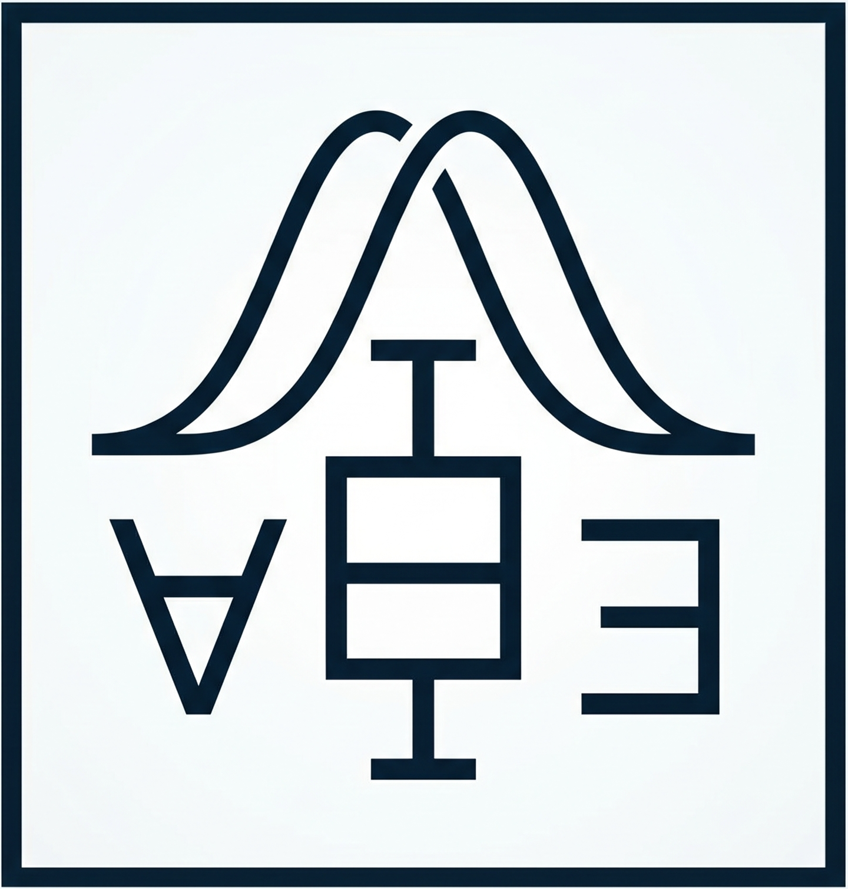
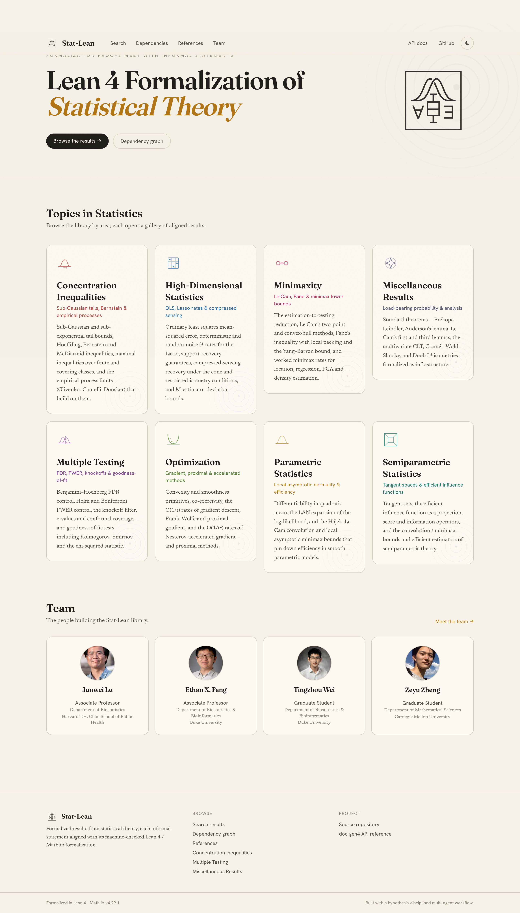
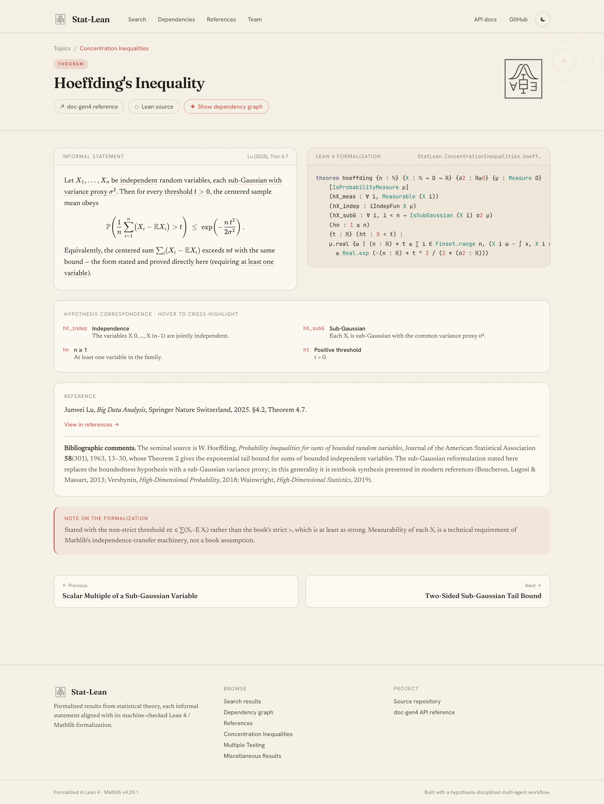
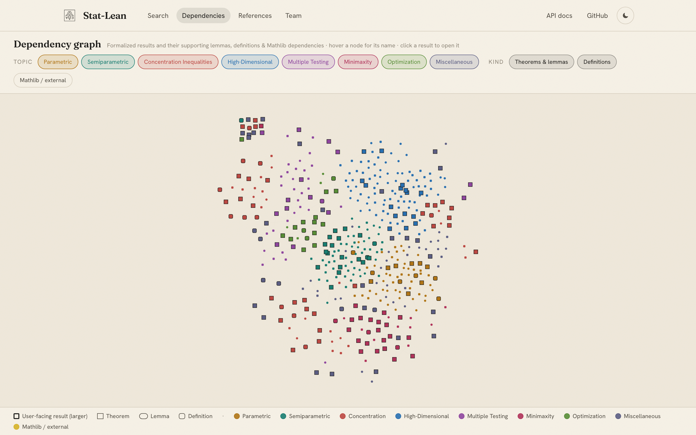

<div align="center">
  <br /><br />

  <h1>Lean 4 Formalization of Statistical Theory</h1>


  <p>
    <a href="https://github.com/StatLean/statlean.github.io/actions/workflows/deploy.yml">
      
    </a>
    <a href="https://statlean.github.io/website/">
      
    </a>
    <a href="https://statlean.github.io/docs/">
      
    </a>
    <a href="https://leanprover.github.io/">
      
    </a>
    <a href="https://leanprover-community.github.io/mathlib4_docs/">
      
    </a>
    <a href="LICENSE">
      
    </a>
  </p>
</div>

## Website

**[https://statlean.github.io/website/](https://statlean.github.io/website/)**

The interactive website lets you browse every formalized result and compare its
informal mathematical statement side-by-side with the Lean 4 proof signature.

<div align="center">
  
</div>

<br />

<table>
  <tr>
    <td width="50%">
      <strong>📐 Informal ↔ Lean side-by-side</strong><br />
      Natural-language statement with LaTeX math and textbook citation alongside the exact Lean <code>theorem</code> or <code>def</code> signature.
    </td>
    <td width="50%">
      <strong>🔦 Hypothesis cross-highlighting</strong><br />
      Hover any hypothesis in the Lean code to highlight the corresponding phrase in the informal statement, and vice versa.
    </td>
  </tr>
  <tr>
    <td>
      <strong>🕸️ Dependency graphs</strong><br />
      Every result has an interactive graph showing the chain of repository lemmas down to the first Mathlib boundary, color-coded by topic.
    </td>
    <td>
      <strong>📝 Note on Informalization</strong><br />
      Each result includes a formalization note explaining design choices, typeclass decisions, and how the Lean encoding relates to the textbook statement. Links to the <a href="https://statlean.github.io/docs/">doc-gen4 API reference</a> for every result.
    </td>
  </tr>
</table>

<div align="center">
  
  <br /><sub><em>Informal statement (left) aligned with Lean signature (right) — hover a hypothesis to cross-highlight.</em></sub>
</div>

<br />

<div align="center">
  
  <br /><sub><em>Global dependency graph — color-coded by topic, click any node to open the result.</em></sub>
</div>

---

## Installation Guide

### 1. Install Lean via [`elan`](https://leanprover-community.github.io/get_started.html)

`elan` manages Lean versions and reads the `lean-toolchain` file to pin the exact version used here.

**macOS / Linux / WSL:**

```bash
curl https://raw.githubusercontent.com/leanprover/elan/master/elan-init.sh -sSf | sh -s -- -y
source $HOME/.elan/env   # add to ~/.zshrc or ~/.bashrc
```

**Windows (PowerShell):**

```powershell
curl -L https://github.com/leanprover/elan/releases/latest/download/elan-init.ps1 -o elan-init.ps1
.\elan-init.ps1
```

Verify:

```bash
elan --version
lean --version    # may say "no toolchain" until step 3 — that is fine
lake --version
```

### 2. Clone

```bash
git clone https://github.com/StatLean/Stat-Lean.git
cd Stat-Lean
```

The library is the single `lean_lib StatLean`, organized into per-area sublibraries under `StatLean/`:

- `StatLean/AsymptoticStatistics/` — parametric & semiparametric asymptotics (van der Vaart, *Asymptotic Statistics*)
- `StatLean/Bayesian/` — posteriors via disintegration, conjugacy, Bayesian decision theory, hierarchical & empirical Bayes, MCMC correctness, posterior contraction (Robert, *The Bayesian Choice*; Bhattacharya–Pati–Pillai–Dunson)
- `StatLean/CausalInference/` — potential-outcomes causal inference: randomized experiments (Fisher's randomization test, Neyman's variance, stratified & matched-pair designs), observational identification (unconfoundedness, standardization, propensity score, IPW, doubly robust AIPW, ATT, matching & trimming), sensitivity analysis (Manski bounds, E-value, Rosenbaum) and instrumental variables (LATE/CACE, instrumental inequalities, linear IV) (Ding, *A First Course in Causal Inference*; Imbens & Rubin, *Causal Inference for Statistics, Social, and Biomedical Sciences*)
- `StatLean/ConcentrationInequalities/` — sub-Gaussian / sub-exponential / Bernstein / maximal inequalities and empirical processes (Lu, *Big Data Analysis*)
- `StatLean/HighDimensionalStatistics/` — OLS, Lasso rates, compressed sensing, M-estimators (Lu, *Big Data Analysis*; Wainwright)
- `StatLean/MultipleTesting/` — FDR / FWER control, knockoffs, goodness-of-fit (Lu, *Big Data Analysis*; Candès)
- `StatLean/Minimaxity/` — Le Cam and Fano minimax lower bounds (Wainwright)
- `StatLean/Optimization/` — gradient, proximal, and accelerated methods (Lu, *Big Data Analysis*)
- `StatLean/StatisticalModels/` — compositional statistical models: model calculus & identifiability, survival / event history, Gaussian conditioning substrate, mixed effects, longitudinal / GEE, missing data (Andersen–Borgan–Gill–Keiding; Liang–Zeger; Rubin)

### 3. Fetch the Mathlib build cache

```bash
lake exe cache get
```

Mathlib is large; this downloads a precompiled cache in minutes instead of building from scratch.

### 4. Build

```bash
lake build
```

### 5. Use as a dependency

Add to your `lakefile.lean`:

```lean
require StatLean from git
  "https://github.com/StatLean/Stat-Lean.git" @ "main"
```

then run `lake update && lake exe cache get && lake build`. Your project must use the same toolchain version as this repository's `lean-toolchain` file.

---


## Topics

Browse the library by area on the [website](https://statlean.github.io/website/):

- **[Bayesian Statistics](https://statlean.github.io/website/#/category/bayesian)** — priors and posteriors via disintegration, sufficiency and conjugate families, Bayesian decision theory and the Bayes route to minimaxity, hierarchical and empirical Bayes, MCMC correctness, and the Bernstein–von Mises theorem.
- **[Causal Inference](https://statlean.github.io/website/#/category/causal)** — potential outcomes and estimands, randomized experiments and Neyman inference, identification by adjustment and matching, augmented inverse-probability weighting and double robustness, and instrumental variables.
- **[Computational Statistics](https://statlean.github.io/website/#/category/compstat)** — Monte Carlo estimation and its error, importance sampling and the optimal importance density, rejection sampling, multinomial resampling of particles, the finite-sample bootstrap and jackknife, and cross-validation.
- **[Probability Inequalities](https://statlean.github.io/website/#/category/concentration)** — sub-Gaussian and sub-exponential tails, Hoeffding, Bernstein and McDiarmid inequalities, maximal inequalities and chaining over covering classes, and the empirical-process limits built on them.
- **[Experimental Design](https://statlean.github.io/website/#/category/expdesign)** — randomization and sampling designs as distributions over allocations, completely randomized and blocked experiments, the analysis-of-variance identity, factorial characters, and Horvitz–Thompson estimation.
- **[High-Dimensional Statistics](https://statlean.github.io/website/#/category/highdim)** — OLS mean-squared error, deterministic and random-noise Lasso rates, support recovery, compressed-sensing recovery, and M-estimator deviation bounds.
- **[Hypothesis Tests](https://statlean.github.io/website/#/category/hypothesistesting)** — the Neyman–Pearson lemma, monotone likelihood ratio and UMP tests, unbiasedness and Neyman structure, invariance and maximal invariants, goodness-of-fit, permutation tests and the bootstrap.
- **[Minimaxity](https://statlean.github.io/website/#/category/minimaxity)** — the estimation-to-testing reduction, Le Cam's two-point and convex-hull methods, Fano's inequality with local packing, and worked minimax rates.
- **[Miscellaneous Results](https://statlean.github.io/website/#/category/probability)** — load-bearing probability and analysis: optional stopping, order statistics, divergences and entropy, packing bounds, and classical limit theorems.
- **[Multiple Testing](https://statlean.github.io/website/#/category/multipletesting)** — Benjamini–Hochberg FDR control, Holm/Bonferroni FWER control, the knockoff filter, e-values, conformal coverage, and goodness-of-fit tests.
- **[Nonparametric Statistics](https://statlean.github.io/website/#/category/nonparametric)** — kernel density estimation over Hölder classes, local polynomial regression, projection estimators, and reproducing-kernel Hilbert spaces from Moore–Aronszajn to Mercer's theorem.
- **[Optimization](https://statlean.github.io/website/#/category/optimization)** — convexity and smoothness primitives, and the convergence rates of gradient descent, Frank–Wolfe, proximal, and Nesterov-accelerated methods.
- **[Parametric Statistics](https://statlean.github.io/website/#/category/parametric)** — the delta method; moment, M-, Z-, and maximum-likelihood estimation; differentiability in quadratic mean; the LAN expansion; and the Hájek–Le Cam convolution and local asymptotic minimax bounds.
- **[Point Estimation](https://statlean.github.io/website/#/category/pointestimation)** — exponential families and sufficiency, completeness and Basu's theorem, the Rao–Blackwell and Lehmann–Scheffé route to UMVU estimators, the Cramér–Rao inequality, and equivariant estimation.
- **[Robust Statistics](https://statlean.github.io/website/#/category/robust)** — gross-error contamination, influence functions and breakdown points, Huber M-estimation and the median's minimax bias, scale and regression quantiles, and sub-Gaussian mean estimation under heavy tails.
- **[Semiparametric Statistics](https://statlean.github.io/website/#/category/semiparametric)** — tangent spaces, efficient influence functions, score operators, and the semiparametric convolution and minimax bounds.
- **[Statistical Learning](https://statlean.github.io/website/#/category/statlearning)** — empirical risk minimization and uniform convergence, PAC and agnostic learnability, VC dimension and growth functions, Rademacher complexity and symmetrization, stability and PAC-Bayes bounds.
- **[Statistical Models](https://statlean.github.io/website/#/category/statisticalmodels)** — survival analysis with censoring, Kaplan–Meier and the Cox model, linear mixed effects and BLUP, GEE sandwich covariance, missing-data mechanisms with IPW, factor models, and graphical models with d-separation.
- **[Time Series](https://statlean.github.io/website/#/category/timeseries)** — stationarity and autocovariance, the Herglotz representation and spectral density, linear filters and ARMA, strong-mixing coefficients and their limit theorems, and the ARCH, GARCH and volatility models.

Each topic page aligns every result's informal statement with its Lean 4 signature, alongside a reference block and an interactive dependency graph.

---

## References

A full bibliography — every textbook and paper cited across the library, together with the results that cite each one — lives on the website:

**[Reference page → https://statlean.github.io/website/#/references](https://statlean.github.io/website/#/references)**
